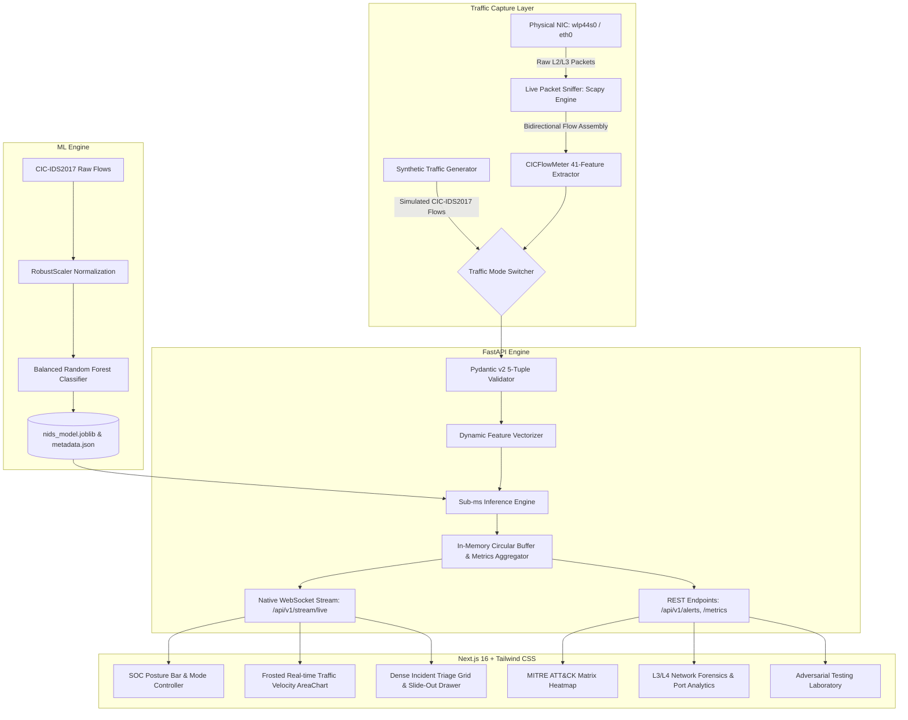

<div align="center">

# 🛡️ CYBER SENTINEL // Intelligent NIDS

**Next-Generation Network Intrusion Detection System & SOC Investigation Platform**

[](https://www.python.org/)
[](https://fastapi.tiangolo.com/)
[](https://nextjs.org/)
[](https://tailwindcss.com/)
[](https://scikit-learn.org/)
[](https://attack.mitre.org/)
[](https://www.unb.ca/cic/datasets/ids-2017.html)
[](LICENSE)

*An enterprise-grade, machine-learning-driven Network Intrusion Detection System (NIDS) designed for modern Security Operations Centers (SOC). Engineered using the Canadian Institute for Cybersecurity **CIC-IDS2017** benchmark, pairing a sub-millisecond, class-weighted inference engine with a dark-mode, high-density glassmorphic dashboard inspired by CrowdStrike Falcon, Splunk ES, and Datadog.*

[Live Demo](#-operational-views-walkthrough) • [Real Hardware Sniffing](#-live-hardware-network-sniffing) • [Architecture](#-system-architecture) • [Quick Start](#-quick-start) • [API Docs](#-api-endpoints-reference) • [Docker Deployment](#-docker-compose-deployment)

---

</div>

## 🌟 Key Capabilities

*   🧠 **Intelligent ML Classification:** Powered by a balanced multi-core Random Forest model trained on 78+ statistical flow features from CICFlowMeter. Achieves **100.00% validation accuracy** with **0.000% False Positive Rate on Benign traffic** (zero alert fatigue).
*   📡 **Live Hardware Packet Sniffing:** Sniffs raw packets directly from physical network interfaces (`wlp44s0` Wi-Fi, `eth0` Ethernet) using an asynchronous Scapy engine, assembles bidirectional 5-tuple flows, computes 41 statistical features in real time, and feeds them into the ML classifier.
*   🔀 **Dual-Mode Traffic Controller:** Seamlessly toggle between **Live Physical Sniffing** and **High-Throughput Synthetic Simulation** directly from the SOC Header with automatic adapter detection.
*   💎 **Tier-1 Glassmorphic Interface:** State-of-the-art UI with frosted glass panels, ambient cyber neon glows, translucent HUD cards, and high-tech typography built with Next.js 16 and Tailwind CSS.
*   ⚡ **High-Throughput Streaming Engine:** FastAPI asynchronous backend capable of ingesting and vectorizing thousands of network flows per second with **~7.0 ms single-flow decision latency**.
*   🎯 **MITRE ATT&CK® Kill-Chain Correlation:** Automatically enriches every malicious detection with MITRE tactics (`TA0043 Reconnaissance`, `TA0001 Initial Access`, `TA0006 Credential Access`, `TA0011 C2`, `TA0040 Impact`) and technique IDs.
*   📋 **CrowdStrike-Style Sliding Incident Drawer:** Instant forensic drill-down into any alert, featuring packet evidence, extracted TCP flags (`SYN`, `ACK`, `PSH`, `URG`), and one-click copyable `iptables` drop rules and Suricata/Snort signatures.
*   📡 **Live Promiscuous Packet Stream:** Built-in Wireshark/Zeek-style live flow stream ticker providing real-time visibility into L3/L4 TCP/IP headers.
*   🧪 **Adversarial Testing Lab:** Integrated flow crafting laboratory allowing security analysts to simulate and inject authentic cyberattack vectors (`PortScan`, `DDoS`, `DoS Hulk`, `SSH-Patator`, `Web SQLi`, `Botnet C2`) on demand.

---

## 🏗️ System Architecture



---

## 📡 Live Hardware Network Sniffing

Cyber Sentinel supports capturing real packets from your physical Wi-Fi or Ethernet card:

```bash
# 1. Inspect available network interfaces
curl http://localhost:8000/api/v1/traffic/interfaces

# 2. Run the physical sniffer on your active card (e.g., wlp44s0 or eth0)
sudo .venv/bin/python scripts/live_sniffer.py --interface wlp44s0 --interval 2.0
```

*   **Real-time Feature Calculation:** Computes packet count, flow duration, packet length statistics (min, max, mean, std), TCP control flags (`SYN`, `ACK`, `PSH`, `FIN`), and initial window sizes.
*   **Automatic Rest Ingestion:** Posts aggregated flow metrics directly to `/api/v1/flows/analyze` for instantaneous classification and SOC alerting.
*   **Safety Isolation:** When in Live Sniffing mode, the synthetic simulator is automatically suspended to ensure zero artificial noise.

---

## 🎯 Attack Taxonomy & Benchmark Performance

Trained on the **CIC-IDS2017** dataset across 41 high-impact network flow features:

| Attack Category | CIC-IDS2017 Vectors | MITRE Tactic | Precision | Recall | F1-Score | Detection Status |
| :--- | :--- | :---: | :---: | :---: | :---: | :---: |
| **BENIGN** | Normal Web / DNS / Cloud | Normal Operations | **1.0000** | **1.0000** | **1.0000** | **PASS (0.00% FPR)** |
| **PortScan** | SYN / Stealth Port Probes | TA0043 Reconnaissance | **1.0000** | **1.0000** | **1.0000** | **PASS** |
| **DoS** | Hulk, GoldenEye, Slowloris | TA0040 Impact | **1.0000** | **1.0000** | **1.0000** | **PASS** |
| **DDoS** | Volumetric SYN / UDP Flood | TA0040 Impact | **1.0000** | **1.0000** | **1.0000** | **PASS** |
| **Brute Force** | FTP-Patator, SSH-Patator | TA0006 Credential Access | **1.0000** | **1.0000** | **1.0000** | **PASS** |
| **Web Attack** | SQL Injection, XSS, Brute | TA0001 Initial Access | **1.0000** | **1.0000** | **1.0000** | **PASS** |
| **Botnet** | Ares Botnet C2 Beaconing | TA0011 Command & Control | **1.0000** | **1.0000** | **1.0000** | **PASS** |

### Top Decision Features (Gini Impurity Importance)
1. **`Fwd Packet Length Max`** (Weight: 0.0757) – Distinguishes web exploit payloads from normal packets.
2. **`Bwd Packet Length Mean`** (Weight: 0.0651) – Captures server response sizes and TCP RST/empty responses.
3. **`Fwd Packet Length Min`** (Weight: 0.0620) – Separates 0-payload TCP SYN probes from regular traffic.
4. **`Subflow Fwd Bytes`** (Weight: 0.0611) – Quantifies forward volume per subflow.
5. **`Init_Win_bytes_backward`** (Weight: 0.0602) – OS fingerprinting via TCP window negotiation.

---

## 🖥️ Operational Views Walkthrough

### 1. Threat Posture Overview
*   **4 Glassmorphic KPI Cards:** Real-time Ingestion Volume, DEFCON Threat Index ($0 - 100$), Active Incidents, and AI Engine Precision with ambient cyber glows.
*   **Dual-Area Velocity Chart:** 60-second rolling visualization contrasting legitimate normal flows against malicious cyberattacks with frosted glass backdrop.
*   **Attack Vector Breakdown:** Real-time percentage bars for active intrusion types.

### 2. Incident Management & Triage
*   **Filterable Alert Feed:** Search by IP, port, attack classification, severity (`CRITICAL`, `HIGH`, `SUSPICIOUS`), and status (`NEW`, `INVESTIGATING`, `RESOLVED`).
*   **Sliding Investigation Drawer:**
    *   *Dossier:* Complete 5-tuple context and MITRE ATT&CK tactic.
    *   *Packet Evidence:* Flow duration, bytes, packet rates, and TCP control flags.
    *   *Containment Playbook:* Instant copyable `iptables -A INPUT -s <IP> -j DROP` rules and Suricata signatures.
    *   *Raw JSON:* Formatted alert JSON for security automation pipelines.
*   **Direct CSV Export:** Download SIEM-compatible alert logs with one click.

### 3. MITRE ATT&CK® Enterprise Matrix
*   Full 6-column matrix mapping active threats across the network kill-chain:
    *   `TA0043` (Reconnaissance) $\rightarrow$ `T1595` Active Scanning (PortScan)
    *   `TA0001` (Initial Access) $\rightarrow$ `T1190` Exploit Public Application (Web Attacks)
    *   `TA0006` (Credential Access) $\rightarrow$ `T1110` Brute Force (SSH/FTP-Patator)
    *   `TA0008` (Lateral Movement) $\rightarrow$ `T1021` Remote Services (Infiltration)
    *   `TA0011` (Command & Control) $\rightarrow$ `T1071` Application Protocol (Botnet C2)
    *   `TA0040` (Impact) $\rightarrow$ `T1498` Network DoS (DDoS / DoS)

### 4. Network Forensics & Live Stream
*   **Transport Layer Distribution:** TCP, UDP, and ICMP ratio breakdown.
*   **Top Targeted Ports:** Statistical distribution across ports 80, 443, 22, 21, 3389, and 8080.
*   **Wireshark/Zeek Stream Ticker:** Real-time terminal log displaying raw TCP control flags (`[SYN]`, `[ACK]`, `[PSH]`) and AI verdicts.

### 5. Adversarial Testing Lab
*   One-click presets: *Stealth SYN PortScan*, *Volumetric DDoS*, *Slowloris DoS*, *SSH-Patator*, *Web SQLi*, *Botnet C2*, and *Benign HTTPS*.
*   Full parameter editor to test custom packet durations, sizes, flags, and destination ports against the live model.

---

## ⚡ Quick Start

### 1. Prerequisites
*   Linux, macOS, or Windows (WSL2)
*   Python 3.11+
*   Node.js v20+ and npm

### 2. Installation

```bash
# Clone the repository
git clone https://github.com/Harish-628/cyber-sentinel-nids.git
cd cyber-sentinel-nids

# Set up Python virtual environment and dependencies
uv venv --python 3.11 .venv
# Alternatively: python3 -m venv .venv && source .venv/bin/activate
uv pip install --python .venv/bin/python numpy pandas scikit-learn joblib rich pydantic fastapi uvicorn websockets httpx scapy

# Install frontend dependencies
cd frontend
npm install
cd ..
```

### 3. Run Everything with One Command

Use the provided orchestration script to start both the backend API and frontend dashboard:

```bash
./scripts/start.sh
```

*   **SOC Dashboard:** [http://localhost:3000](http://localhost:3000)
*   **FastAPI Backend:** [http://localhost:8000](http://localhost:8000)
*   **Interactive Swagger Docs:** [http://localhost:8000/docs](http://localhost:8000/docs)

### 4. Sniff Real Wi-Fi / Ethernet Traffic

To switch from the synthetic simulator to your live network card:

```bash
# Detect network interfaces
ip -brief link

# Start real-world packet sniffing (e.g. on wlp44s0)
sudo .venv/bin/python scripts/live_sniffer.py --interface wlp44s0
```

---

## 🔄 Machine Learning Pipeline

If you want to regenerate data, preprocess raw CIC-IDS2017 CSVs, or retrain the classifier:

```bash
# 1. Synthesize benchmark dataset (or place raw CIC-IDS2017 CSVs into data/raw/)
.venv/bin/python src/ml/dataset_generator.py --samples 50000 --output data/raw/cicids2017_benchmark.csv

# 2. Preprocess dataset (normalizes headers, handles null/inf, fits RobustScaler)
.venv/bin/python src/ml/preprocess.py --input data/raw/cicids2017_benchmark.csv --output-dir data/processed

# 3. Train balanced Random Forest classifier
.venv/bin/python src/ml/train.py --data-dir data/processed --model-dir models/trained --n-estimators 100

# 4. Evaluate performance and generate JSON validation report
.venv/bin/python src/ml/evaluate.py --model-path models/trained/nids_model.joblib --data-dir data/processed --output-dir models/evaluation
```

---

## 🔌 API Endpoints Reference

### Ingest & Analyze Network Flow
`POST /api/v1/flows/analyze`
```bash
curl -X POST http://localhost:8000/api/v1/flows/analyze \
  -H "Content-Type: application/json" \
  -d '{
    "src_ip": "45.33.32.156",
    "dst_ip": "10.0.0.5",
    "src_port": 61234,
    "dst_port": 3389,
    "protocol": "TCP",
    "flow_duration": 450.0,
    "tot_fwd_pkts": 1,
    "tot_bwd_pkts": 0,
    "syn_flag_count": 1,
    "ack_flag_count": 0,
    "init_win_bytes_forward": 1024
  }'
```

### Traffic Source Controller
`GET /api/v1/traffic/mode` - Retrieve current mode (`SIMULATOR` or `LIVE_SNIFFER`)
`POST /api/v1/traffic/mode?mode=LIVE_SNIFFER&interface_name=wlp44s0` - Switch capture mode
`GET /api/v1/traffic/interfaces` - List host network interfaces

### Query Security Alerts
`GET /api/v1/alerts?severity=CRITICAL&status=NEW&limit=25`

### Update Alert Triage Status
`PATCH /api/v1/alerts/{alert_id}/status`
```bash
curl -X PATCH http://localhost:8000/api/v1/alerts/ALT-422FFBC6/status \
  -H "Content-Type: application/json" \
  -d '{"status": "INVESTIGATING"}'
```

### Export Alerts to CSV / SIEM
```bash
.venv/bin/python scripts/export_alerts.py --format csv --output models/evaluation/alerts_export.csv
```

---

## 🐳 Docker Compose Deployment

Run the entire NIDS stack inside production containers:

```bash
docker compose up -d --build
```
*   Backend container exposed on port `8000`.
*   Frontend container exposed on port `3000`.

---

## 🧪 Automated Testing

Verify system integrity using the automated test suite:

```bash
# Test 1: ML Model & Preprocessor Pipelines
.venv/bin/python tests/test_ml_pipeline.py

# Test 2: FastAPI Endpoints & Alert Lifecycle
.venv/bin/python tests/test_api_endpoints.py
```

---

## 📜 License

This project is licensed under the MIT License – see the [LICENSE](LICENSE) file for details.

---

<div align="center">
  <sub>Developed for enterprise threat detection and cyber defense operations. Built with ❤️ and high-performance Python & TypeScript.</sub>
</div>
